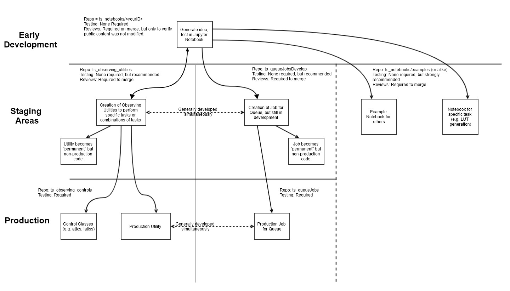

..
  Technote content.

  See https://developer.lsst.io/restructuredtext/style.html
  for a guide to reStructuredText writing.

  Do not put the title, authors or other metadata in this document;
  those are automatically added.

  Use the following syntax for sections:

  To add images, add the image file (png, svg or jpeg preferred) to the
  _static/ directory. The reST syntax for adding the image is

  .. figure:: /_static/filename.ext
     :name: fig-label

     Caption text.

   Run: ``make html`` and ``open _build/html/index.html`` to preview your work.
   See the README at https://github.com/lsst-sqre/lsst-technote-bootstrap or
   this repo's README for more info.

   Feel free to delete this instructional comment.

:tocdepth: 1

.. Please do not modify tocdepth; will be fixed when a new Sphinx theme is shipped.

.. sectnum::

.. TODO: Delete the note below before merging new content to the master branch.

.. note::

   **This technote is still being drafted and has not yet been accepted as the official workflow.**

.. Do not include the document title (it's automatically added from metadata.yaml).

Introduction
===============
This technote is to detail out the observing jobs (previously known as scripts or SAL scripts)
and notebook development cycle from a simple test
or idea, developed inside a notebook, to evolving into a method that could be called by other
notebooks, and/or into a Job to be called via the Queue, then finally to the level of being a sanctioned and
regularly maintained Job as part of operations.

Details for each step include which repos should be used for the different aspects of development and the level of
testing/review required at each stage. The note is built upon a sample use-case which was encountered early on in the
commissioning phase of the AuxTel, where a user wants to derive a high-level piece of functionality which requires
new additions to code at multiple levels to implement as a final production Job. In short, the use-case is:

    - Slew to a target
    - Take an image and perform basic ISR such that it can be analyzed.
    - Find the brightest point source in the image, determine its location, calculate the telescope offset required to
      put the star on a specific pixel (within a tolerance).
    - Perform a series of observations using multiple instrument setups and exposure times.
      This will also require changing telescope focus (and pointing) for each setup.

A general overview of the development flow, as viewed from the user, is as follows:

    - Draft, test and flush-out their desired functionality in a notebook.

      This may include creating drafts of functions (e.g. calculating offsets), performing calls to high-level classes
      (e.g. slew telescope)

    - Create observing utilities to perform specific tasks, which may be sufficiently generic such that they may be used
      by other use-cases (e.g. find a star and put it on pixel [x,y]).

    - Create a job, which is runnable by the Queue, to perform these tasks.

      Note that at this point the utilities may still be rough, and certain functionality might be better accomplished
      in lower classes (e.g. attcs) but that functionality does not yet exist.

    - Request new functionality in lower-level control classes (e.g. attcs)

    - Migrate/evolve the utilities and Job to a production level for regular use.

How the workflow moves through the various repositories is represented by the following diagram, where each of the
sections is discussed in detail below.

    A visual overview of the workflow process, starting from an original idea first demonstrated in a Jupyter notebook.

.. note::

    This technote avoids the use of the term "scripts" and also assumes the current scriptQueue has been renamed to
    "Queue". The reasoning behind this is that "scripts" is an overloaded word where each person has their own
    interpretation where the general tendency is to assume a bash-script type of execution.

.. _notebooks:

Jupyter notebooks
=================
Jupyter notebooks (henceforth referred to as notebooks) will be the primary tool used in system verification
and commissioning. The environment permits the simultaneous control of observatory functionality, data
reduction/analysis tasks and documentation. This is the natural starting point for development of ideas
and demonstrating proof of concept(s). In the use-case referenced in this technote, notebooks are the starting point,
where the user is free to do as they wish with its structure/content etc.

User's notebooks are currently stored in the `ts_notebooks <https://github.com/lsst-ts/ts_notebooks>`_ repository.
There is also a section where individuals create
directories with their identifying name (e.g. pingraham). Notebooks should be cleared of all
data prior to committing/pushing, to prevent the repo size from ballooning.
The repo also holds a series of `examples` which ranges from telescope operation to EFD mining/analysis.

Users should still follow the T&S development guidelines when using this repo. That means, create a ticket
branch to work on, commit code and, once ready, open a PR to have their work integrated to the
`develop` branch. Content added to the users directory are still subjected to the PR process but only
to guarantee that the content was cleared out and that no changes where made to other users
content (without permission). Contents in the `examples` directory will be subject to a more
rigorous review process.

.. note::

    Ideally, example notebooks would also have a sort of testing to ensure functionality remains over time. DM is
    working on a solution but it would mandate the notebooks can be run on the LSP. If we can make the notebooks
    run on the ncsa-integration-teststand then hopefully this same test method can be applied.

It is understood that the practice of storing notebooks, particularly the personal notebooks, will not scale into
commissioning. It is anticipated that this repo will split
into multiple components such as example notebooks, operations-focused notebooks (where they will be run by operators
to diagnose or characterize certain behaviour), and personal notebooks. The details of this organization are beyond the
scope of this technote. Until the re-organisation is completed, tags will be made of the repo at least every ~6 months,
after which all files larger than 20 MB (TBR) or older than 1 year will be deleted from the develop branch.

.. note::

    Another suggestion is to use git-lfs for large files, or the personal folders in the repo. This needs further
    exploration. A copy would need to be available at the summit should the network go down.

.. _Observing_Utilities:

Observing Utilities
====================

Observing utilities are user-defined methods that perform tasks that are not already part of the control classes code
base that operates the observatory (the `Control Classes`_ section discusses this in further detail).
An example of functionality contained in a
utility would be the reduction/analysis of an image. In the use-case discussed in this document, the user defines
methods that perform basic ISR on an image, finds the center of the star, and calculates the required offset. In the
cases where image reduction and/or analysis is required, specifically for ComCam and LSSTCamera images, the
processing will utilize the `OCS Controlled Pipeline Service (OCPS) <https://dmtn-133.lsst.io/>`_, which is still
undergoing development.

The repo sanctioned for the development and use of such functions is the `ts_observing_utilities` repo, which follows
an `LSST standard package format <https://github.com/lsst/templates>`_.
Users develop their functions on a branch and the functions must go through a review (PR) process prior to being
merged to the develop branch. This area is designed to act as a staging area prior to having their functionality either
moved into control classes, or promoted to sanctioned utilities which would be contained in the
`ts_observatory_controls` repo (discussed in `Control Classes`_ section).

The development practices of this area are purposefully loose to promote rapid coding and integration. Although
functions should follow a generic standard, the only strict requirement is that each function possess a deprecation
date. This is required to guard against bit-rot. As will be discussed below, all Jobs under development must have
unit tests to verify the desired utilities are not expiring. This is discussed further in `Control Utilities`_.
Utilities with deprecation dates that are 60 (TBD) days past will be removed.

.. Important::

    Anything is this repo is *not* allowed to be called by production level Jobs that are to be executed
    by the Queue. Should a Job be promoted from `ts_queueJobsDevelop` to `ts_queueJobs` (discussed below) then
    this repo must be cleaned of any dependencies.

.. Note::

    There is a `Python library <https://pypi.org/project/deprecation/>`_ available that allows developers and users to
    mark methods for deprecation using a decorator. It may be worth considering using this library as a standard
    practice.

.. _Control Classes:

Control Classes
===============
Control Classes perform coordination of CSC functionality at a high-level. An example of such an operation
is slewing the telescope and dome, discussed in more detail below. Because these classes are used throughout many
areas of operations, high levels of unit and integration testing are required;
especially if utilities are contained outside the class. High-level control classes live in their own repository
(`ts_observatory_controls`). These classes are written and tightly controlled by the T&S team.

In the example use-case for this technote, the user wishes to take images with multiple instrument setups. Because the
focus changes with
different glass thicknesses and wavelength, this is the type of functionality that really should belong in the standard
Control Classes. However, while this use-case was being developed, that functionality didn't exist and was therefore
contained in a utility (in `ts_observing_utilities`).

To remedy this, the proper path forward is to request that the additional functionality be added. To do this,
the user should file a JIRA ticket with the requested functionality for review. This will trigger discussion on whether
the functionality should indeed be implemented. Upon conclusion of that discussion, a user can either wait for it to be
implemented or make the changes themselves and submit a pull-request.

In the meantime, the utility in `ts_observing_utilities` must remain until the functionality gets included in the
Control Classes. Once included, the utility should be deprecated and the appropriate code updated accordingly.

ATTCS
-----
The `ATTCS class <https://github.com/lsst-ts/ts_standardscripts/blob/develop/python/
lsst/ts/standardscripts/auxtel/attcs.py>`_ contains methods that coordinate telescope and dome related CSCs. The class
includes methods that
capture complex activities in single lines of executable code such as slewing the telescope and dome (shown in the
example below), offsetting in multiple coordinate systems, starting/stopping of tracking etc.
Any Required low-level functionality should be pushed into these classes.

.. note::

    At the moment the attcs at latiss classes live in
    `ts_standardscripts <https://github.com/lsst-ts/ts_standardscripts>`_ but
    will migrate to `ts_observatory_control` upon agreement upon the restructuring presented in this document.

.. code-block:: python

    from lsst.ts.standardscripts.auxtel.attcs import ATTCS
    attcs = ATTCS()
    await attcs.start_task
    await attcs.slew_icrs(ra="20:25:38.85705", dec="-56:44:06.3230", sky_pos=0., target_name="Alf Pav")

Alternatively, the `ATTCS` class also provides a `slew_object` method that queries
the object coordinate from `Simbad <http://simbad.u-strasbg.fr/simbad/>`_.

.. code-block:: python

    from lsst.ts.standardscripts.auxtel.attcs import ATTCS
    attcs = ATTCS()
    await attcs.start_task
    await attcs.slew_object(name="Alf Pav", sky_pos=0.)

LATISS
------
The `LATISS class <https://github.com/lsst-ts/ts_standardscripts/blob/develop/python/
lsst/ts/standardscripts/auxtel/latiss.py>`_ coordinates the ATSpectrograph and ATCamera CSCs, taking various types of
images from a single command. This results in the proper metadata being published such that the image headers
are captured correctly.

.. code-block:: python

    from lsst.ts.standardscripts.auxtel.latiss import LATISS
    latiss = LATISS()
    await latiss.start_task
    exp_id = await latiss.take_engtest(exptime=10, filter='RG06', grating='empty_1')

.. _Control Utilities:

Control Class Utilities
-----------------------

Control Class Utilities are analogous to the utilities discussed in `Observing Utilities`_, but have been evolved and
moved into the production code areas. Sanctioned Control Class Utilities will exist at multiple levels.
These utilities will primarily be called by jobs for the Queue, but not in all cases.
Top level utilities will apply to both telescopes, all instruments, then each level down will have it's own utilities.
An example of this could (not necessarily will) be the centering utility described above, since the desired
position for stars in LATISS will differ from the main telescope.

Control Utilities all require unit tests, many of which will require data to perform. This will require a central
repo/place where this data is stored.

.. TODO::
    DM has developed a way to do this, we should explore if this solution works for this case as well.
    For test data used in unit tests DM uses git-lfs to store repositories that are set up as eups packages.
    Another possible solution is Travis, which is useds to test the LSST EFD helper class.
    Docker spins a temporary influxDB instance and loads test EFD data into it. A similar pattern could be loaded
    to test code that needs EFD data.

The utilities will live in the `ts_observatory_control` repo with the Control Classes.

.. _Tasks:

Jobs for the Queue
==================

The Queue is the mechanism to run Jobs in an automated fashion during commissioning and
operations. The level of robustness required for these Jobs is divided among those still in development, and those
which are in full production.

Jobs in Development
-------------------
Jobs (scripts) undergoing development live in the `ts_queueJobsDevelop` repo. While in this repo, the Jobs are
permitted to call utilities in the `Observing Utilities`_ repository as it will often be the case that the user is
developing utilities to be used with a Job. Of course, it may also call any of the Control Classes or utilities. Jobs
and utilities in these areas are expected to follow a standard format/template and conform to proper standards
(PEP8 and appropriate LSST Development Guides). Pushing from a ticket branch to the develop branch of the repo
requires a review (PR).

There will (probably) exist cases where a Job will never be promoted to a production task. In this case, the jobs must
be identified as such and will be subject to a higher level of documentation and required unit testing,
particularly against any possible utilities that may be deprecated. Significant effort should be made to ensure
that any persistent Jobs in this repo do not require anything in the `Observing Utilities`_ repository.

Required Unit Testing
^^^^^^^^^^^^^^^^^^^^^

All Jobs in development must (at a minimum) include a unit test that checks for a deprecation warning from utilities.
Should the test fail due the deprecation date passing, the only way to pass the test is to file a PR that
changes the deprecation date in the utility. The default extension is 4 weeks. This is done to prevent bit-rot in the
`Observing Utilities`_ repository.

.. note::

    Ideally we'd have a mapping between which Jobs call which utilities and vise-versa.
    This would make it straightforward to know who should be involved in reviewing PRs.
    Unfortunately, I'm not sure how to (easily) do that.

Jobs in Production
------------------
Jobs in full production are to be kept in the `ts_queueJobs` repository. This is the last step in the
development process. Jobs in this category are tightly controlled and standards are strictly enforced. No production
level Job can call any utility in the `Observing Utilities`_ repository. All utilities must be sanctioned Control
Utilities.

.. note::

    The ts_standardscripts repo currently holds the production Jobs but will be renamed.

Required Unit Testing
^^^^^^^^^^^^^^^^^^^^^
Rigorous unit testing is required for production jobs.

.. .. rubric:: References

.. Make in-text citations with: :cite:`bibkey`.

.. .. bibliography:: local.bib lsstbib/books.bib lsstbib/lsst.bib lsstbib/lsst-dm.bib lsstbib/refs.bib lsstbib/refs_ads.bib
..    :style: lsst_aa
