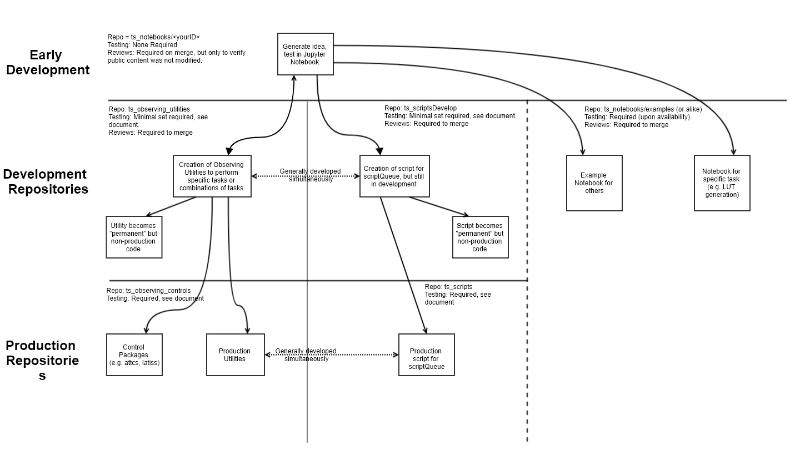

:tocdepth: 1

.. Please do not modify tocdepth; will be fixed when a new Sphinx theme is shipped.

.. sectnum::

Introduction
===============
This technote is to detail out the observing scripts and notebook development cycle from a simple test
or idea, developed inside a notebook, to evolving into a method that could be called by other
notebooks, and/or into a script to be called via the scriptQueue, then finally to the level of being a sanctioned and
regularly maintained script as part of operations.

Documented below are the details for each step include which repos should be used for the different aspects of
development and the level of
testing/review required at each stage. The note is built upon a sample use-case which was encountered early on in the
commissioning phase of the AuxTel, where a user wants to derive a high-level piece of functionality which requires
new additions to code at multiple levels to implement as a final production script. In short, the use-case is:

    - Slew to a target
    - Take an image and perform basic instrument-signature-removal (ISR) such that it can be analyzed, notably bias
      subtraction and cosmic-ray rejection/interpolation.
    - Find the brightest point source in the image and calculate the telescope offset required to
      put the star on a specific pixel (within a tolerance).
    - Perform a series of observations using multiple instrument setups and exposure times.
      This will also require changing telescope focus (and pointing) for each filter/grating configuration.

A general overview of the development flow, as viewed from the user, is as follows:

    - Draft, test and flush-out their desired functionality in a notebook.

      This may include creating drafts of functions (e.g. calculating offsets), performing calls to high-level classes
      (e.g. slew telescope) etc.

    - Create observing utilities to perform specific tasks, which may be sufficiently generic such that they may be used
      by other use-cases (e.g. the function of finding a star and calculating the offset to pixel [x,y]).

    - Create a script, which is runnable by the scriptQueue, to perform these tasks.

      Note that at this point the utilities may still be rough, and certain functionality might be better accomplished
      in lower classes (e.g. attcs) but that functionality does not yet exist.

    - Request new functionality in lower-level control classes (e.g. attcs)

    - Migrate/evolve the utilities and script to a production level for regular use with the scriptQueue

How the workflow moves through the various repositories is represented by the following diagram, where each of the
sections is discussed in detail below.

    A visual overview of the workflow process, starting from an original idea first demonstrated in a Jupyter notebook.

The three-tiered development strategy is being adopted to facilitate maximum flexibility to implement changes on
short timescales. The staging and development areas gives users full range to simultaneously operate across multiple
versions/branches with unhindered flexibility. This is especially important for commissioning activities where rapid
code changes are required and temporary implementation is required which will break other people's code in the same
area.

The production area is to provide a single code base where all code in that area (on the master and develop branches) is
fully functional at all times. This will be most important during operations when the codebase will be less dynamic
but will also be useful for different commissioning teams that will circle through and want an established and stable
repository to start from without having to diagnose what changes the previous group has made to facilitate their
goals. This area of the codebase will also require larger amounts of
testing in order to ensure that changes made in one area do not result in breaking code in another.

.. _notebooks:

Jupyter notebooks
=================
Jupyter notebooks (henceforth referred to as notebooks) will be the primary tool used in system verification
and commissioning. The use of them is not strictly required, however the environment permits the simultaneous
control of observatory functionality, data reduction/analysis tasks and documentation and is supported by the project.
This is the natural starting point for development of ideas
and demonstrating proof of concept(s). In the use-case referenced in this technote, notebooks are the starting point,
where the user is free to do as they wish with its structure/content etc.

User's notebooks are currently stored in the `ts_notebooks <https://github.com/lsst-ts/ts_notebooks>`_ repository.
There is also a section where individuals create
directories with their identifying username (e.g. pingraham or tribeiro). Notebooks should be cleared of all
data prior to committing/pushing, to prevent the repo size from ballooning.
The repo also holds a series of `examples` which ranges from telescope operation to EFD mining/analysis.

Users should still follow the T&S development guidelines when using this repo. That means, create a ticket
branch to work on, commit code and, once ready, open a PR to have their work integrated to the
`develop` branch. Content added to the users directory are still subjected to the PR process but only
to guarantee that the content was cleared out and that no changes where made to other users
content (without permission). Contents in the `examples` directory will be subject to a more
rigorous review process and will require continuous integration (CI) testing.

.. note::

    DM is working on a CI solution for notebooks but it would mandate that the tests be run from a place where the
    data is accessible (e.g. the LSP). Hopefully we can set something up on the ncsa-integration-teststand
    and apply this (or a similar) method.

.. note::
    Mocking CSC or control class functionality may be required to perform tests will real data. Mocks are also useful
    in other aspects of development. The usefulness and functionality of the mocks has been demonstrated but additional
    work is required to fully incorporate them into the development workflow.

It is understood that the practice of storing notebooks, particularly the personal notebooks, will not scale into
commissioning. It is anticipated that this repo will split
into multiple components such as example notebooks, operations-focused notebooks (where they will be run by operators
to diagnose or characterize certain behaviour), and personal notebooks. The details of this organization are beyond the
scope of this technote. Until the re-organisation is completed, tags will be made of the repo at least every 6 months
or before/after major
activities. After each release, user will be asked to review and possibly remove notebooks older than 1 year to make
sure stale notebooks are not lingering alongside the main working branch.

.. _Observing_Utilities:

Observing Utilities
====================

Observing utilities are user-defined methods that perform tasks that are not already part of the control packages code
base that operates the observatory (the `Control Packages`_ section discusses this in further detail).
An example of functionality contained in a
utility would be the reduction/analysis of an image. In the use-case discussed in this document, the user defines
methods that perform basic ISR on an image, finds the center of the star, and calculates the required offset. In the
cases where image reduction and/or analysis is required, specifically for ComCam and LSSTCamera images, the
processing will utilize the `OCS Controlled Pipeline Service (OCPS) <https://dmtn-133.lsst.io/>`_, which is still
undergoing design and development. More details on it's use during development will be added once available.

The repo sanctioned for the development and use of such functions is the `ts_observing_utilities` repo, which follows
an `LSST standard package format <https://github.com/lsst/templates>`_.
Users develop their functions on a branch and the functions shall go through a review (PR) process prior to being
merged to the develop branch. This area is designed to act as a staging area prior to having their functionality either
moved into control packages, or promoted to sanctioned utilities which would be contained in the
`ts_observatory_controls` repo (discussed in `Control Packages`_ section).

The development practices of this area are purposefully loose to promote rapid coding and integration.

Required Testing:
^^^^^^^^^^^^^^^^^

Requirements on code prior to merging are minimal. In short, the code should be runnable and should be documented
at a level such that other people can identify what it does, as well as the inputs and outputs.

.. Important::

    Code this repo is *not* allowed to be called by production level scripts *that are not on a ticket branch*. This
    is because changes in this repo do not require all tests in the production code areas to be run which could
    therefore lead to breakages.

.. Note::

    There is a `Python library <https://pypi.org/project/deprecation/>`_ available that allows developers and users to
    mark methods for deprecation using a decorator. It may be worth considering using this library to prevent bit-rot.

.. _Control Packages:

Control Packages
================
Control Packages perform coordination of CSC functionality at a high-level. An example of such an operation
is slewing the telescope and dome, discussed in more detail below. Because these packages (often written as classes)
are used throughout many areas of operations, more significant levels of unit and integration testing are required;
especially if utilities are contained outside the class. High-level control packages live in their own repository
(`ts_observatory_controls`). These classes are written and tightly controlled by the T&S team.

As mentioned in the introduction, the master and develop branches of this codebase shall be entirely runnable at
all times.

In the example use-case for this technote, the user wishes to take images with multiple instrument setups. Because the
focus changes with
different glass thicknesses and wavelength, this is the type of functionality that really should belong in the standard
Control Package. However, while this use-case was being developed, that functionality didn't exist and was therefore
developed in a utility (in `ts_observing_utilities`).

To remedy this, the proper path forward is to request that the additional functionality be added. To do this,
the user should file a JIRA ticket with the requested functionality for review in the DM project with the
team set to Telescope and Site. This will trigger discussion on whether
the functionality should indeed be implemented. Upon conclusion of that discussion, a user can either wait for it to be
implemented or make the changes themselves and submit a pull-request.

In the meantime, the utility in `ts_observing_utilities` shall remain until the functionality gets included in the
Control Packages. Once included, the utility should be deprecated and the appropriate code updated accordingly.

Control Package Examples
^^^^^^^^^^^^^^^^^^^^^^^^
The following are examples of classes written to perform basic control operations of the telescope, dome and instrument.

ATTCS
-----
The `ATTCS class <https://github.com/lsst-ts/ts_standardscripts/blob/develop/python/
lsst/ts/standardscripts/auxtel/attcs.py>`_ contains methods that coordinate telescope and dome related CSCs. The class
includes methods that
capture complex activities in single lines of executable code such as slewing the telescope and dome (shown in the
example below), offsetting in multiple coordinate systems, starting/stopping of tracking etc.
Any required low-level (non-CSC) functionality should be pushed into these classes.

.. note::

    At the moment the attcs at latiss classes live in
    `ts_standardscripts <https://github.com/lsst-ts/ts_standardscripts>`_ but
    will migrate to `ts_observatory_control` upon agreement upon the restructuring presented in this document.

.. code-block:: python

    from lsst.ts.standardscripts.auxtel.attcs import ATTCS
    attcs = ATTCS()
    await attcs.start_task
    await attcs.slew_icrs(ra="20:25:38.85705", dec="-56:44:06.3230", sky_pos=0., target_name="Alf Pav")

Alternatively, the `ATTCS` class also provides a `slew_object` method that queries
the object coordinate from `Simbad <http://simbad.u-strasbg.fr/simbad/>`_.

.. code-block:: python

    from lsst.ts.standardscripts.auxtel.attcs import ATTCS
    attcs = ATTCS()
    await attcs.start_task
    await attcs.slew_object(name="Alf Pav", sky_pos=0.)

LATISS
------
The `LATISS class <https://github.com/lsst-ts/ts_standardscripts/blob/develop/python/
lsst/ts/standardscripts/auxtel/latiss.py>`_ coordinates the ATSpectrograph and ATCamera CSCs, taking various types of
images from a single command. This results in the proper metadata being published such that the image headers
are captured correctly.

.. code-block:: python

    from lsst.ts.standardscripts.auxtel.latiss import LATISS
    latiss = LATISS()
    await latiss.start_task
    exp_id = await latiss.take_engtest(exptime=10, filter='RG06', grating='empty_1')

.. _Control Utilities:

Control Package Utilities
^^^^^^^^^^^^^^^^^^^^^^^^^

Control Package Utilities are analogous to the utilities discussed in `Observing Utilities`_, but have been evolved and
moved into the production code areas. Sanctioned Control Utilities will exist at multiple levels.
These utilities will primarily be called by scripts for the scriptQueue, but not in all cases.
Top-level utilities will apply to both telescopes, all instruments, then each level down will have it's own utilities.
An example of this could (not necessarily will) be the centering utility described above, since the desired
position for stars in LATISS will differ from the main telescope.

Utilities should be as atomic as possible and may not perform actions that get performed by the control classes
(e.g. ATTCS and LATISS), such as slewing the telescope.

The utilities will live in the `ts_observatory_control` repo with the Control Classes.

Required Testing
----------------

All code in the `ts_observatory_control` requires documentation to a level where other developers can diagnose the
utility and fix any issues that are resulting in failed tests. This shall include a description of the utility, a
description of the inputs/outputs, and depending on the complexity of the function, examples may be required.

Each utility shall come with a set of tests (and accompanying data if required), tests shall include:

- Validation of appropriate input types (dtypes)

    - Verification of appropriate input values are only required if the values are not checked/verified elsewhere (such
      as at lower levels (e.g. the CSCs).

- Testing of end-to-end functionality for the primary functions for appropriate inputs

    - E.g. does it correctly measure the centroid on a piece of test data to within a given tolerance?

- Testing that common edge cases are properly captured/treated

- Testing is *not* required for *all* possible input parameters and combinations

The following level of integration tests (on the NCSA-integration test stand) are also required:

- All scripts and utilities in the controls package shall successfully pass all tests.

    - Ideally this would be done automatically using a CI framework. If not available, then an artifact needs
      to be shown as part of PR
    - Tests have to pass **before merging** not just at the time of creating the PR.

.. TODO::
    DM has developed a way to do this, we should explore if this solution works for this case as well.
    For test data used in unit tests DM uses git-lfs to store repositories that are set up as eups packages.
    Another possible solution is Travis, which is used to test the LSST EFD helper class.
    Docker spins a temporary influxDB instance and loads test EFD data into it. A similar pattern could be loaded
    to test code that needs EFD data.

.. _Tasks:

Scripts for the scriptQueue
===========================

The scriptQueue is the mechanism to run scripts in an automated fashion during commissioning and
operations. The level of robustness required for these scripts is divided among those still in development and those
which are in full production.

Scripts in Development
^^^^^^^^^^^^^^^^^^^^^^
Scripts undergoing development live in the `ts_scriptsDevelop` repo. While in this repo, the scripts are
permitted to call utilities in the `Observing Utilities`_ repository as it will often be the case that the user is
developing utilities to be used with a script. Of course, it may also call any of the functionality in the Control
Package Repository (`ts_observatory_control`). Scripts
and utilities in the `ts_scriptsDevelop` and `ts_observing_utilities` areas are expected to follow a standard
format/template and conform to proper standards
(PEP8 and `TSSW Development Guide <https://tssw-developer.lsst.io/>`_ ). Pushing from a ticket branch to the develop
branch of the repo requires a review (PR).

There will (probably) exist cases where a script will never be promoted to a production task. In this case, the scripts
shall be identified as such and will be subject to a higher level of documentation and required testing,
particularly against any possible utilities that may be deprecated. Significant effort should be made to ensure
that any persistent scripts in this repo do not require anything in the `Observing Utilities`_ repository as it will not
be stable with time.

Required Testing
----------------

In order to merge a branch to the develop branch, each script shall:

- Have correctly populated metadata (e.g. author(s), semi-accurate run-times, description of script goals,
  input parameters, output data etc.
- Have (and pass) a unit test showing the script is of a format that is capable of being executed

    - This will use the helper class in standardscripts already (BasescriptTestCase). This verifies the
      classes/functions conform with the baseclass and verifies the script won't fail due to syntax etc.
      It does not check format/readability/sensible inputs etc.

No integration testing (on the ncsa-teststand) is strictly required, however, one would hope that the script has run
successfully through the integration-test-stand or on the summit.

Scripts in Production
^^^^^^^^^^^^^^^^^^^^^

Scripts in full production are to be kept in the `ts_scripts` repository. This is the last step in the
development process. Scripts in this category are tightly controlled and standards are strictly enforced. No production
level script can call any utility in the `Observing Utilities`_ repository. All called utilities shall be sanctioned
Control Package Utilities. All scripts in this repository shall be runnable at all times by any operator. All code
shall be documented at a level where other developers can diagnose the
code and fix any issues that are resulting in failed tests. This shall include a description of the script, a
description of the inputs/outputs, and depending on the complexity of the function an example may be required.
All required metadata for the script shall be accurate (e.g. completion times). The following testing requirements shall
also be met.

Required Testing
----------------

In order to merge to develop the following level of testing shall be implemented and passing:

- Code shall be fully documented.

- Have (and pass) a unit test showing the script is of a format that is capable of being executed

    - This will use the helper class in standardscripts already (BasescriptTestCase). This verifies the
      classes/functions conform with the baseclass and verifies the script won't fail due to syntax etc.
      It does not check format/readability/sensible inputs

- Validation of inputs (checks dtypes not the values themselves)
- Unit testing of called utilities are not re-tested here, unless required by special circumstance

Integration tests (on teststand):

- Script shall run successfully through the integration-test-stand using a test dataset.

    - Standard usage modes of the script should have tests. Non-standard functionality tests not strictly required
      but strongly recommended.

- All other scripts and utilities shall also be successfully passing all unit tests and pass tests run on the
  test-stand. Tests have to pass **before merging** not just at the time of PR.

.. .. rubric:: References

.. Make in-text citations with: :cite:`bibkey`.

.. .. bibliography:: local.bib lsstbib/books.bib lsstbib/lsst.bib lsstbib/lsst-dm.bib lsstbib/refs.bib lsstbib/refs_ads.bib
..    :style: lsst_aa
